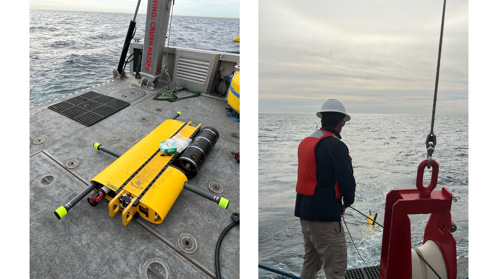

<div style="display: flex; align-items: flex-start;">
  <div style="flex: 2;">
    </div>
  <div style="flex: 1; text-align: center; padding-left: 20px;">
    
  </div>
</div>

## FreeWILLI: Free software for Whale Identification and Localization with Low-power Implementation

The FreeWILLI project provides a modular suite of algorithms for real-time passive acoustic array data processing, designed specifically for low-resource edge devices such as Raspberry Pi and microcontrollers. It includes:

🔎: **Detection and Filtering** – Identify and isolate relevant acoustic signals efficiently.

🎯: **Multi-Target Tracking** – Track multiple sources in real-time using a novel hybrid cluster-filter approach.

🧠: **Neural Network Inference** – Perform real-time inference using ONNX-based deep learning models, optimized for edge computing.
 
Originally developed for real-time marine mammal monitoring, FreeWILLI is adaptable for a wide range of low-power applications. Feel free to leverage and customize this software for your needs!


#### Branches
```main```: Designed for desktop machines (Linux/macOS) and Raspberry Pi.


```teensy-dev```: Optimized for Teensy 4.1 microcontrollers, implementing key algorithms with minimal memory and computational overhead.

## Table of Contents

1. [Download FreeWILLI](#download-freewilli)
2. [Repository Structure](#repository-structure)
3. [Dependencies](#dependencies)
     - [Installing Dependencies with Docker (Recommended)](#installing-dependencies-with-docker-recommended)
     - [Installing Dependencies Manually for Listener on Linux](#installing-dependencies-manually-for-listener-on-linux)  
     - [Installing Dependencies Manually for Listener on macOS](#installing-dependencies-manually-for-listener-on-macos)
     - [Installing Dependencies Manually for Simulator on Linux/macOS](#installing-dependencies-manually-for-simulator-on-linuxmacos) 
4. [Listener](#listener)
   - [Technical Overview](#technical-overview)
   - [Signal Processing Pipeline](#signal-processing-pipeline)
   - [Directory Structure](#directory-structure)   
   - [Native Build: Linux & macOS](#native-build-Linux--macos)
   - [Cross-Compilation with Docker: Raspberry Pi Zero2W](#cross-compilation-with-docker-raspberry-pi-zero2w)
5. [Simulator](#simulator)
6. [Run Example](#run-example)
7. [Announcements](#announcements)

## Download FreeWILLI

1. Clone the repository:

``` bash
git clone https://github.com/JosephLWalker96/FreeWILLI.git
cd FreeWILLI
```

2. Initialize and Update Submodules:
Run the following commands from the root of the repository:

```bash
git submodule init
git submodule update --init --recursive
```

## Repository Structure

This repo consists of two programs:

1. **Listener**: The real-time acoustic data processing program.

2. **Simulator**: A program for simulating a hydrophone array.  Sends pre-recorded data as UDP packets to a specified IP address and port. Used for testing and development of the Listener program.

The repository is organized as follows:
- ```.github/workflows/```: Contains GitHub Actions workflows for continuous integration and deployment. 
- ```.vscode/```: Configuration files for Visual Studio Code, including workspace settings and extensions.
- ```analysis/```: Scripts and tools for analyzing and visualizing data outputs from the Listener program.
- ```listener_program/```: Source code and resources for the Listener program.
- ```simulator_program/```: Source code and resources for the Simulator program. 
- ```supplemental/```: Additional files, documentation, or supporting scripts.
- ```.gitignore```: Specifies files and directories to be ignored by Git.
- ```.gitmodules```: Configuration for managing Git submodules.
- ```CONTRIBUTING.md```: Guidelines for contributing to the project.

## Dependencies

- **CMake**: A build system generator used to configure and build the project across multiple platforms.
- **FFTW3**: Required for performing fast Fourier transforms.
- **Eigen**: Used for advanced linear algebra operations, such as matrix manipulations and decompositions.
- **nlohmann-json**: A JSON library for parsing and managing configuration files.
- **ONNX Runtime**: Used for running machine learning models in the program.

### Installing Dependencies with Docker (Recommended)

1. Build Docker Image with a Custom Port

By default, it will use port 1045, but you can specify a custom port at build time:
```bash
cd listener_program/
docker build -t freewilli-exec .
```

2. Run the Container

You can run the container:
```bash
docker run --rm -it --network host --user $(id -u):$(id -g) -v $(pwd):/app freewilli-exec
```
	
| Argument | Description |
| --------------- | --------------- |
| --rm	| Removes the container after it exits to prevent leftover containers.|
| -it	| Runs the container in interactive mode (-i for input, -t for a TTY).|
| --network host	| Uses the host network instead of Docker's default bridge network. This allows the container to communicate with services on the host without port mapping.|
| --user $(id -u):$(id -g) |	Runs the container as the current user (id -u for user ID, id -g for group ID), preventing root-owned files on the host system.|
| -v $(pwd):/app	| Mounts the current directory ($(pwd)) to /app inside the container, allowing access to files from the host.|
| freewilli-exec	| The name of the Docker image to run.|


See section on installing simulator with docker. Then see section on running track example.

### Installing Dependencies Manually for Listener on Linux
1. Example Installing CMake 3.29.7 on Linux x86
Use wget to download the precompiled binary from the official CMake website:
```bash
wget https://github.com/Kitware/CMake/releases/download/v3.29.7/cmake-3.29.7-linux-x86_64.sh
```

Make the downloaded file executable and run it to install CMake:
```bash
chmod +x cmake-3.29.7-linux-x86_64.sh
sudo ./cmake-3.29.7-linux-x86_64.sh --skip-license --prefix=/usr/local
```

Confirm the installed version of CMake:
```bash
cmake --version
```

2. Install the required libraries using apt:
```bash
sudo apt-get update
sudo apt-get install -y build-essential libfftw3-dev libeigen3-dev nlohmann-json3-dev
```

3. Download and install ONNX Runtime
```bash
wget https://github.com/microsoft/onnxruntime/releases/download/v1.14.1/onnxruntime-linux-x64-1.14.1.tgz
tar -xzf onnxruntime-linux-x64-1.14.1.tgz
sudo cp -r onnxruntime-linux-x64-1.14.1/include/* /usr/local/include/
sudo cp -r onnxruntime-linux-x64-1.14.1/lib/* /usr/local/lib/
```

### Installing Dependencies Manually for Listener on macOS
1. Example Installing CMake 3.29.7 on macOS
Use curl to download the precompiled binary from the official CMake website:
```bash
curl -L -o cmake-3.29.7-macos-universal.dmg https://github.com/Kitware/CMake/releases/download/v3.29.7/cmake-3.29.7-macos-universal.dmg
```

Mount the .dmg file to access the installer:
```bash
hdiutil attach cmake-3.29.7-macos-universal.dmg
```

Open the mounted volume and drag the CMake application to your preferred location (e.g., /Applications

Add CMake to PATH
```bash
sudo "/Applications/CMake.app/Contents/bin/cmake" /usr/local/bin/cmake
```

Confirm the installed version of CMake:
```bash
cmake --version
```


1. Install the required libraries using brew:
```bash
brew install fftw eigen nlohmann-json
```

2. Download and install ONNX Runtime
```bash
curl -L -o onnxruntime-osx-arm64-1.19.2.tgz https://github.com/microsoft/onnxruntime/releases/download/v1.19.2/onnxruntime-osx-arm64-1.19.2.tgz
tar -xzf onnxruntime-osx-arm64-1.19.2.tgz
sudo mkdir -p /usr/local/include/onnxruntime /usr/local/lib
sudo cp -r onnxruntime-osx-arm64-1.19.2/include/* /usr/local/include/onnxruntime/
sudo cp -r onnxruntime-osx-arm64-1.19.2/lib/* /usr/local/lib/
```
### Installing Dependencies Manually for Simulator on Linux/macOS
Install dependencies:
```bash
cd simulator_program/
conda create --name freewilli python=3.9
conda activate freewilli
pip install -r requirements.txt
```


## Listener

### Technical Overview

Uses a **producer/consumer concurrency pattern** with threads created in ```src/main.cpp```. Shared data and synchronization are handled by ```SharedDataManager()``` from ```src/shared_data_manager.h```

Key architectural features include:

**Pipeline Execution Model**: Signal processing steps are executed sequentially using the Pipeline Pattern. The Pipeline class is created and initialized in ```src/main.cpp``` and it's method ```process()``` calls the main signal processing loop ```dataProcess()``` and wraps it in a ```try/catch``` block.

**Factory Pattern**: Objects for various algorithms (e.g., filters, detection modules) are dynamically created using a factory.

### Signal Processing Pipeline

The signal processing pipeline consists of the following main steps, executed sequentially:

1. *Time Domain Detection*: A time domain detector is applied to identify segments of interest. This step reduces computational overhead by filtering irrelevant data.

2. *Frequency Domain Transformation and Filtering*: The detected signal segments are transformed into the frequency domain using the Fast Fourier Transform (FFT). If filtering is enabled, Finite Impulse Response (FIR) filters are applied in the frequency domain to isolate frequency bands of interest. The filter coefficients are loaded from a configuration file in the ```filters/``` directory, and the frequency-domain representation is computed dynamically at runtime.

3. *Frequency Domain Detection*: A frequency domain detector is applied to identify segments of interest. This step reduces computational overhead by filtering irrelevant data.

4. *TDOA Estimation with GCC-PHAT*:
Time Difference of Arrival (TDOA) is calculated using the Generalized Cross-Correlation with Phase Transform (GCC-PHAT) algorithm. 

5. *DOA Estimation*: The Direction of Arrival (DOA) of detected signals is estimated using a computationally efficient approach. This step leverages precomputed matrices derived from the Singular Value Decomposition (SVD) of the hydrophone position matrix. The hydrophone position matrix is loaded from a file in the ```receiver_pos/``` directory.

### Directory Structure
Top-level Directories:
- ```benchmark/```: Contains source code for autmated benchmark tests.
- ```bin/```: Stores compiled executables of the program.
- ```config_files/```: JSON files for specifiying runtime configuration 
- ```debug/```: Contains debug builds of the program and tests.
- ```deployment_files/```: Stores data and files produced by the program at runtime
- ```filters/```: Contains filter coefficients used for signal processing, which are loaded into the program during runtime.
- ```libs/```: Contains git submodules.
- ```ML_models/```: Stores pre-trained machine learning models.
- ```out/```: Stores build artifacts generated by the build system (e.g., CMake).
- ```receiver_pos/```: Stores receiver/hydrophone position data used for TDOA and DOA calculations.
- ```src/```: Main source code of the program.
- ```tests/```: Contains unit test source code.

Top-level Files:
- ```block_wifi_bluetooth.sh```: A shell script to disable Wi-Fi and Bluetooth on Raspberry Pi Zero 2W.
- ```CMakeLists.txt```: The main build configuration file for CMake.
- ```compile_commands.json```: A file for enabling IntelliSense or static analysis in IDEs like VS Code, containing compile options.
- ```CrossCompileSettings.cmake```: CMake configuration for cross-compiling (e.g., for ARM-based devices like Raspberry Pi).
- ```NativeCompileSettings.cmake```: CMake configuration for native compilation on the host system.
- ```run_program.sh```: A script for running the program with pre-defined arguments and setup steps.
- ```toolchain.cmake```: Specifies the toolchain file for cross-compilation.
- ```unblock_wifi_bluetooth.sh```: A shell script to re-enable Wi-Fi and Bluetooth.
  


### Native Build: Linux & macOS

1. Build the program:
```bash
cd listener_program/
mkdir out/ && cd out
cmake ..
make -j$(nproc)
```

2. Run the binary:
```bash
cd ..
./bin/Listener config_files/volumetric.json 50000
```

### Cross-Compilation with Docker: Raspberry Pi Zero2W
This section provides step-by-step instructions to cross-compile your program for the Raspberry Pi Zero 2W using Docker.

By using a prebuilt Docker image, you avoid manually setting up a cross-compilation toolchain on your local machine.

1. First, pull the prebuilt cross-compiler Docker image from Docker Hub:
```bash
docker pull josephlwalker96/cross-compiler:latest
```

2. Navigate to the ```listener_program/``` directory and run the container:
```bash
cd listener_program/
docker run --rm -it --user $(id -u):$(id -g) -v $(pwd):/app josephlwalker96/cross-compiler:latest
```

3. Inside the container, create a build directory and compile the program:
```bash
mkdir out/ && cd out
cmake -DCMAKE_TOOLCHAIN_FILE=../toolchain.cmake ..
make -j$(nproc)
```

4. After compilation, verify the generated binaries:
Cross-compiled binaries are denoted with an 'X' appended to their names.

```bash
ls ../bin/*
```

Expected output:
```bash
../bin/ListenX  ../bin/UnitTestsX
```

## Simulator

A Python-based simulator that streams prerecorded data packets over UDP. The simulator mimics the behavior of firmware-based data logging systems. It can read .npy files, process their contents (e.g., apply channel offsets for TDOA testing, scale the data, etc.), and send out structured UDP packets for testing the Listener program.

### File Structure
```bash
.
├── datalogger_simulator.py   # The main simulation script
├── firmware_config           # Firmware-specific configuration files
│   ├── firmware_1240.py
│   └── firmware_1550.py
├── simulator_data            # Directory containing .npy data files
├── utils.py                  # Shared utility functions (e.g., data manipulation, concurrency helpers)
└── requirements.txt          # Python dependencies needed to run the simulator
```

- **datalogger_simulator.py**
This script is the simulator itself. It performs the following tasks:
1. Command-line argument parsing (to customize data streaming IP, port, etc.).
2. Loading data from .npy files.
3. (Optionally) applying channel duplication, shifting, stretching, glitches, and more.
4. Sending the processed data over UDP.

## Program Description
The simulator is designed to emulate a real-time data capture and logging system:

1. **Firmware Emulation:**
Selects firmware configuration (e.g., ```firmware_1240.py```) based on user arguments to determine packet structure and timing intervals.

2. **Data Streaming:**
Reads .npy data files (which contain raw sample data).
Preprocesses the data (e.g., interleaving, scaling, time-stamping).
Sends packets over UDP to a specified IP and port.

3. **Optional Features:**

- **Looping**: Repeatedly stream the same data files in a loop.
- **TDOA Simulation**: Applies channel offsets to simulate time-difference-of-arrival.
- **Glitches**: Intentionally modifies timestamps or data packets to test receiver robustness.
- **IMU Data**: Appends IMU packets if enabled, to simulate additional sensor data.


### Notes
**High Priority**: The simulator can set high priority (low niceness) for the process (using ```SetHighPriority()``` in ```utils.py```) if using a Unix based system.

**Multiprocessing**: Uses multiple processes to preload the next .npy file while the current one is streaming. This helps achieve smoother, more real-time data streaming.


### Run Example

1. **Prepare Data Files**

By default, the simulator program reads in data (.npy files) from the folder ```simulator_data/track132_5minchunks/```

[Download](https://drive.google.com/drive/folders/1UHr5gYuFRVvfLXsXLfc5mc5AA_aJcf_5?usp=drive_link) the ```track132_5minchunks/``` folder and place it in the ```simulator_data/``` directory.

2. **Run the Listener**

```bash
cd listener_program
./bin/Listener config_files/volumetric.json 50000
```

This will run the Listener program according to the specifications of the ```config_files/volumetric.json``` configuration file. The program will auomatically terminate after ```50000``` seconds.

3. **Run the Simulator**

```bash
python3 datalogger_simulator.py \
    --ip self \
    --port 1045 \
    --data_dir simulator_data/track132_5minchunks/ \
    --fw 1240 \
```

This example will by default load data from ```simulator_data/track132_5minchunks/``` and organize the data according to the firmware version ```1240```. The data is sent to to port ```1045``` at IP address ```self```, which is translated to the loopback address.

## Announcements
2/25/2025: FreeWILLI was showcased at the 9th Annual Naval Applications of Machine Learning Conference in San Diego, California. Watch the presentation [here](https://youtu.be/KadqlTlNLGU).

12/11/2024: FreeWILLI was successfully deployed on a [Wirewalker](https://www.delmarocean.com/) using a planar hydrophone configuration.
Location: San Diego Trough, (32°51'14.2"N 117°37'05.2"W)
<div style="display: flex; align-items: flex-start;">
  <div style="flex: 2;">
    </div>
  <div style="flex: 1; text-align: center; padding-left: 20px;">
    
  </div>
</div>
